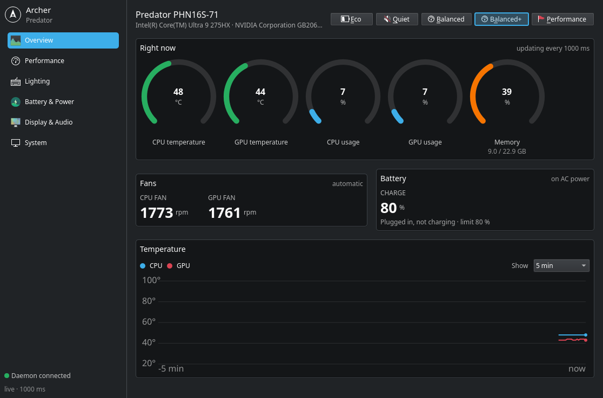
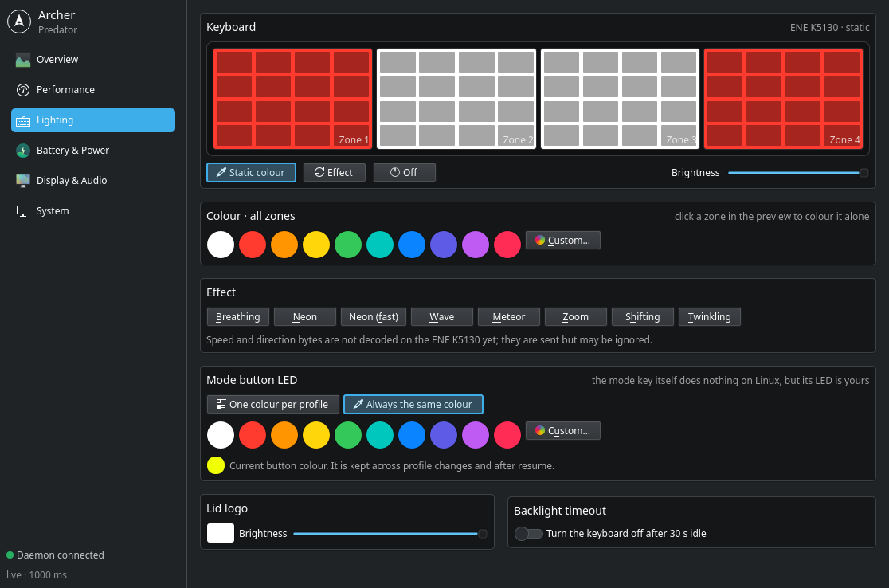
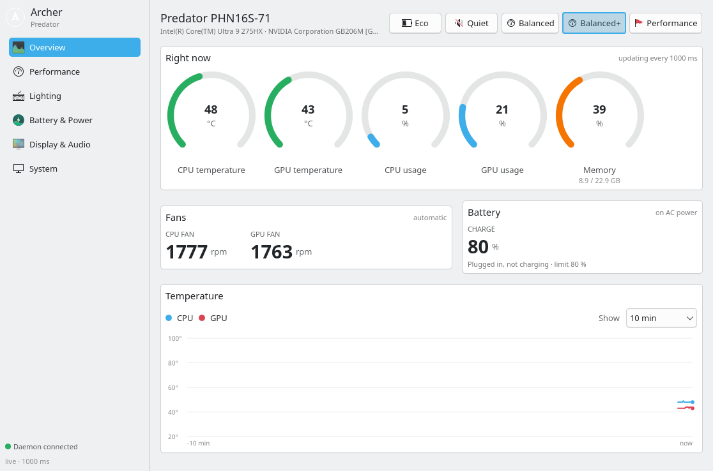
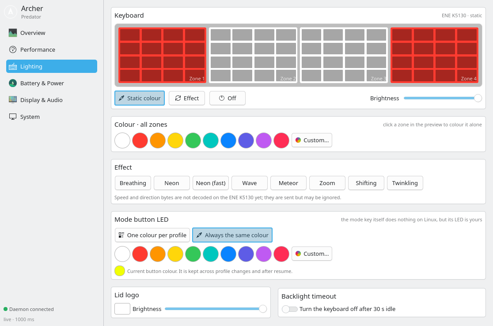

# Archer

Control panel and daemon for Acer Predator / Nitro laptops on Arch Linux: performance
profiles, fans, keyboard and LED lighting, battery, GPU mode — live, native to the
desktop, and light enough to leave running.

| Overview | Lighting |
|---|---|
|  |  |
|  |  |

Maintained by [Hector Huaripata](https://github.com/HectorHuaripata). Developed and
verified on a Predator Helios Neo 16S AI (PHN16S-71); the installer's module system,
driver integration and daemon core come from [otectus/Archer](https://github.com/otectus/Archer)
(MIT), which this project started from. What is new here — see `CHANGELOG.md` —
is the Qt 6 / QML panel, the typed D-Bus contract (`docs/DBUS_V2.md`), the ENE K5130
lighting backend (`docs/ENE_PROTOCOL.md`) and a daemon that does no work while nobody
is looking.

Developed with the support of [Claude](https://claude.ai) (Anthropic), working as a
pair-programming assistant: it proposed designs, wrote code and measurements, and
the maintainer ran everything on the hardware and decided what shipped. Commits
carry a `Co-Authored-By: Claude` trailer where that applies; every behavioural
claim in the docs was verified on the machine, not inferred.

## The compatibility suite

A modular compatibility suite for Acer laptops running Arch Linux and Arch-based distributions. Provides hardware-aware detection, kernel driver installation, a Qt 6 / QML control panel with D-Bus IPC and polkit authorization, and targeted fixes for a broad range of Acer laptop issues on Linux.

## Supported Hardware

| Model Family | Fan/RGB (Driver) | Battery Limit | GPU Switching | Touchpad Fix | Audio Fix | WiFi/BT | Power Mgmt | Thermal Profiles |
|-------------|:-:|:-:|:-:|:-:|:-:|:-:|:-:|:-:|
| **Nitro**       | R | R | R | O | O | O | O | O |
| **Predator**    | R | R | R | O | O | O | O | O |
| **Helios**      | R | R | R | O | O | O | O | O |
| **Triton**      | R | R | R | O | O | O | O | O |
| **Swift**       | O | R | - | O | O | O | O | - |
| **Aspire**      | O | R | O | O | O | O | O | - |
| **Spin**        | O | R | - | O | O | O | O | - |

**R** = Recommended, **O** = Optional/Available, **-** = Not applicable

## Supported Distributions

- Arch Linux
- CachyOS (auto-detected kernel headers)
- EndeavourOS
- Manjaro
- Garuda Linux

## Architecture

Archer uses a root daemon with a D-Bus system service for secure hardware control:

```
Archer GUI (Qt 6 / QML)  ──  D-Bus (io.github.archer.Control1)  ──  Archer Daemon (root)
       │                              │                                  │
  6 sections                   typed properties                     sysfs / hwmon / NVML
  system tray                  PropertiesChanged deltas             Linuwu-Sense · ENE K5130
  live bindings                polkit on setters
```

- **Daemon** (`archer-daemon.service`): Runs as root, communicates with hardware via sysfs/hwmon, exposes a D-Bus interface with polkit-protected methods.
- **D-Bus contract v2** (`io.github.archer.Control1`, see `docs/DBUS_V2.md`): every reading and setting is a typed property; changes arrive as `PropertiesChanged` deltas; telemetry is sampled only while a client is subscribed. Setters are polkit-gated; the active local session needs no password for day-to-day controls. The legacy `io.otectus.Archer1` JSON interface is still served for third-party scripts and goes away in 3.0.
- **GUI** (`gui-qt/`): Qt 6 / QML with Kirigami, Breeze-native on Plasma, follows the system colour scheme. Pages are created on first visit; hidden to the tray it unsubscribes from telemetry and costs no CPU.
- **Installer**: Bash-based modular system with 13 modules, hardware detection, manifest tracking, and interactive menu.

## Available Modules

### 1. Linuwu-Sense Kernel Driver (driver)
Installs the [Linuwu-Sense](https://github.com/0x7375646F/Linuwu-Sense) kernel driver via DKMS for fan speed control, RGB keyboard access, and battery management at the hardware level. Blacklists the default `acer_wmi` module for exclusive hardware access.

### 2. Battery Charge Limit (battery)
Installs the [acer-wmi-battery](https://github.com/frederik-h/acer-wmi-battery) DKMS module to limit charging to 80%, extending battery lifespan. Persists across reboots via a udev rule. Prefers AUR installation when `paru` or `yay` is available.

### 3. GPU Switching (gpu)
Installs [EnvyControl](https://github.com/bayasdev/envycontrol) for NVIDIA Optimus hybrid graphics management. Supports three modes:
- **hybrid** — Integrated GPU by default, NVIDIA on demand (recommended)
- **nvidia** — Always use discrete GPU
- **integrated** — Disable NVIDIA entirely for maximum battery life

### 4. Touchpad Fix (touchpad)
Addresses I2C HID touchpad detection failures common on several Acer models. Applies up to three strategies:
- AMD `pinctrl_amd` module load ordering fix
- Systemd service for I2C HID module reload on boot
- GRUB kernel parameters (`i8042.reset i8042.nomux`)

### 5. Audio Fix (audio)
Installs SOF firmware and ALSA UCM configuration. Platform-specific fixes:
- **AMD**: Configures SOF driver, disables legacy ACP PDM conflicts
- **Intel**: Validates SOF firmware loading, rebuilds initramfs if needed

### 6. WiFi/Bluetooth Troubleshooting (wifi)
Chipset-aware diagnostics and fixes:
- **MediaTek** (MT7921/MT7922/MT7925): Firmware checks, PCIe device reset, compatibility warnings
- **Intel** (AX200/AX210/AX211/BE200): rfkill unblocking, firmware validation
- **Realtek**: Guidance for AUR out-of-tree drivers
- Common: Bluetooth service setup, NetworkManager enablement

### 7. Power Management (power)
Installs [TLP](https://linrunner.de/tlp/) with an Acer-optimized configuration:
- Performance governor on AC, powersave on battery
- WiFi power management, USB autosuspend
- Runtime PM for PCI devices (NVIDIA GPU power saving)

### 8. Kernel Thermal Profiles (thermal)
Enables native `acer_wmi` thermal profile support on kernel 6.8+. Provides access to Eco, Silent, Balanced, Performance, and Turbo modes via the standard `platform_profile` sysfs interface and the physical mode button.

> **Conflict Warning**: This module requires `acer_wmi` to be loaded, which conflicts with the driver module (Linuwu-Sense blacklists `acer_wmi`). You cannot use both simultaneously.

### 9. Archer GUI (gui)
Qt 6 / QML control panel with a root daemon for real-time hardware management. Every control reflects the hardware within a second, whoever changed it (the mode button, Plasma, a script), and applies as you move it — there are no Apply buttons.
- **Overview** — animated CPU/GPU temperature and usage gauges, fan RPM, battery, 5-minute chart, profile bar
- **Performance** — profile, game mode, fans (automatic / manual / curve)
- **Lighting** — four-zone keyboard preview (click a zone to colour it alone), swatches and colour dialog applied live, effects, mode-button LED colour per profile, lid logo, backlight timeout
- **Battery & Power** — charge limit, calibration, USB charging while asleep, LCD override, boot sound, wake sources
- **Display & Audio** — GPU mode (integrated/hybrid/nvidia) via envycontrol, microphone noise suppression
- **System** — machine info, detected capabilities, firmware updates, driver parameter, daemon/driver restart
- **System tray** — quick profile switch, temperatures in the tooltip; closing the window hides to the tray

> **Note**: Requires a display server (X11 or Wayland). Install the driver module first for full hardware control.

### 10. Game Mode (gamemode)
Installs [GameMode](https://github.com/FeralInteractive/gamemode) for automatic performance optimization during gaming. Switches CPU governor to performance, adjusts GPU power mode, and applies I/O priority tuning. The Archer daemon also provides a Game Mode toggle for manual activation.

### 11. Audio Enhancement (audio-enhance)
Sets up real-time microphone noise suppression via PipeWire and [rnnoise](https://github.com/xiph/rnnoise). Creates an "Archer Noise Suppression" virtual audio source that can be selected in any application for clean, noise-free input.

### 12. Camera Enhancement (camera-enhance)
Installs [v4l2loopback](https://github.com/umlaeute/v4l2loopback) to create an "Archer Camera" virtual device for background blur and camera effects. Provides the foundation for AI-powered camera processing.

### 13. Firmware Advisor (firmware)
Installs [fwupd](https://fwupd.org/) for firmware update detection. Displays current BIOS version and checks the Linux Vendor Firmware Service (LVFS) for available updates. Advisory only — never performs automatic updates.

## Installation

Clone the repository and run the installer:

```bash
git clone https://github.com/otectus/Archer.git
cd Archer
./install.sh
```

The installer will:
1. Detect your hardware (model, GPU, WiFi chipset, battery, kernel, distro)
2. Recommend modules based on detected hardware
3. Present an interactive menu for module selection (13 modules)
4. Install shared dependencies and selected modules
5. Verify each installation and report results

### Non-Interactive Installation

```bash
# Install all recommended modules
./install.sh --all

# Install specific modules
./install.sh --modules "driver,battery,gpu,gui"

# Skip confirmation prompts
./install.sh --all --no-confirm

# Preview without making changes
./install.sh --dry-run

# Check status of installed modules
./install.sh --verify

# Show help
./install.sh --help
```

### CLI Flags

| Flag | Description |
|------|-------------|
| `--all` | Install all recommended modules (non-interactive) |
| `--modules LIST` | Comma-separated list of module IDs to install |
| `--verify` | Check status of previously installed modules |
| `--no-confirm` | Skip all confirmation prompts |
| `--dry-run` | Show what would be done without making changes |
| `--verbose` | Enable debug output for troubleshooting |
| `--log FILE` | Write all output to FILE (in addition to console) |
| `--help`, `-h` | Show help message |
| `--version`, `-v` | Show installer version |

## Verification

After installation, verify the state of installed modules:

```bash
# Linuwu-Sense Driver
dkms status                                    # linuwu-sense should show 'installed'
lsmod | grep linuwu_sense                      # Module should be loaded

# Archer Daemon (D-Bus)
sudo systemctl status archer-daemon            # Daemon should be active
busctl introspect io.otectus.Archer1 /io/otectus/Archer1  # D-Bus methods visible

# Archer GUI
archer-gui                                     # Launch the control panel

# Battery
cat /sys/bus/wmi/drivers/acer-wmi-battery/health_mode  # Should read '1'

# GPU
envycontrol --query                            # Should show configured mode

# TLP
sudo tlp-stat -s                               # Should show TLP active

# Thermal Profiles
cat /sys/firmware/acpi/platform_profile        # Should show current profile

# Audio Enhancement
pactl list sources | grep "Archer Noise"       # Virtual source should appear

# Firmware
fwupdmgr get-devices                           # Should list detected devices
```

## Configuration

The Archer daemon persists user settings to `/etc/archer/settings.json`. This file is managed automatically and survives reboots. Settings include:

- Thermal profile selection
- Fan speed and custom curve definitions
- Keyboard RGB colors and effect modes
- Battery charge limit and USB charging level
- Game mode state
- Audio enhancement toggles
- LCD override and boot sound preferences

Settings are restored automatically when the daemon starts.

## Uninstallation

The uninstaller reads the install manifest to selectively remove only what was installed:

```bash
./uninstall.sh
```

If no manifest is found (legacy installation), a fallback removes all known components.

## Project Structure

```
Archer/
  install.sh                      # Main entry point with interactive menu
  uninstall.sh                    # Manifest-aware uninstaller
  lib/
    utils.sh                      # Shared logging, error handling, helpers
    detect.sh                     # Hardware detection and recommendation engine
    manifest.sh                   # Install state tracking (JSON manifest)
  modules/
    driver.sh                     # Linuwu-Sense kernel driver (DKMS)
    battery.sh                    # acer-wmi-battery charge limiting
    gpu.sh                        # EnvyControl GPU switching
    touchpad.sh                   # I2C HID touchpad fixes
    audio.sh                      # SOF firmware and audio config
    wifi.sh                       # WiFi/Bluetooth troubleshooting
    power.sh                      # TLP power management
    thermal.sh                    # Kernel thermal profiles
    gui.sh                        # Archer GUI + daemon + D-Bus + polkit
    gamemode.sh                   # Game Mode (GameMode + governor switching)
    audio-enhance.sh              # Audio noise suppression (PipeWire/rnnoise)
    camera-enhance.sh             # Virtual camera (v4l2loopback)
    firmware.sh                   # Firmware update advisor (fwupd)
  gui/
    archer_daemon.py              # Root daemon (D-Bus, sysfs, fan curves, game mode)
    archer_dbus.py                # D-Bus service with polkit authorization
    archer_control/               # D-Bus contract v2 (io.github.archer.Control1): store, telemetry, interfaces/
    archer_ene.py                 # ENE K5130 keyboard/LED backend
    io.otectus.Archer1.conf       # D-Bus system bus policy
    io.otectus.Archer1.policy     # Polkit action definitions
    archer-daemon.service         # Systemd service unit
    io.github.archer.desktop      # Desktop entry
    assets/                       # Icons (SVG, PNG)
  gui-qt/
    archer_qt.py                  # Qt 6 / QML control panel entry point
    archerqt/                     # D-Bus bridge (Gio) and application glue
    qml/                          # Main window, pages, components
  dbus/
    io.github.archer.Control1.xml # Contract v2 introspection (source of truth)
```

## Technical Notes

- **Secure Boot**: If Secure Boot is enabled, you must manually sign DKMS kernel modules (linuwu-sense, acer-wmi-battery) or disable Secure Boot.
- **BIOS Configuration**: Some Acer laptops ship with RAID storage mode enabled. Switch to AHCI mode in BIOS for Linux compatibility. Disable Fast Startup for dual-boot setups.
- **CachyOS**: The installer automatically detects CachyOS kernels and installs the correct `-cachyos-headers` package. Clang/LLVM compiler flags are applied when a Clang-built kernel is detected.
- **AUR Helpers**: Modules that install AUR packages (battery, GPU, audio-enhance) prefer `paru` or `yay` if available, with manual fallback otherwise. The installer never installs an AUR helper for you.
- **D-Bus / Polkit**: The daemon registers `io.github.archer.Control1` (v2, typed) and `io.otectus.Archer1` (legacy JSON) on the system bus. Reading is unprivileged. Day-to-day setters (profile, fans, lighting, battery, game mode) need no password in the active local session; the GPU mode switch asks once per session (`auth_admin_keep`) and system-level operations (restart, modprobe) always prompt (`auth_admin`).
- **Install Manifest**: Stored at `/var/lib/archer/install-manifest.json` (root-owned, 0644). Tracks installed modules, files, DKMS modules, and packages for clean uninstallation. Manifests from older user-home locations (`~/.local/share/archer/`, legacy `~/.local/share/damx/`) are migrated automatically on the next install or uninstall run.
- **Fan Curve Safety**: The fan curve engine includes a watchdog that restores EC automatic control if the daemon crashes or 3 consecutive control ticks fail.

## Troubleshooting

### GUI shows "Daemon Offline" or "Stale"

1. Confirm the daemon is running:
   ```bash
   systemctl status archer-daemon
   ```
   If it's not active, start it: `sudo systemctl restart archer-daemon`.

2. Confirm the D-Bus name is claimable:
   ```bash
   busctl list | grep io.otectus.Archer1
   busctl introspect io.otectus.Archer1 /io/otectus/Archer1
   ```
   If the name isn't visible, the policy file may not be loaded. The installer reloads `dbus.service` automatically, but you can do it manually:
   ```bash
   sudo systemctl reload dbus.service
   sudo systemctl restart archer-daemon
   ```

3. Tail the daemon log for the actual failure:
   ```bash
   sudo journalctl -u archer-daemon -n 100 --no-pager
   ```

If the GUI shows the status flipping between "Connected" and "Stale", the daemon is up but not emitting telemetry on schedule — check `journalctl` for `TelemetryUpdated emit failed` messages (often a transient sysfs/nvidia-smi hang).

### GUI hangs forever / never opens

Almost always means D-Bus is unreachable. Same triage as above. The GUI now applies a 5s timeout to every D-Bus call and shows the failure in a toast, so a daemon hang manifests as a quick "Daemon Offline" notification rather than a frozen window.

## Changelog

Release notes and migration guidance: [CHANGELOG.md](CHANGELOG.md).

## Contributing

To add a new module, create `modules/<id>.sh` implementing the module interface:

```bash
MODULE_NAME="Display Name"
MODULE_ID="module-id"
MODULE_DESCRIPTION="What this module does"

module_detect()          # Return 0 if relevant to current hardware
module_check_installed() # Return 0 if already installed
module_install()         # Perform installation
module_uninstall()       # Reverse installation
module_verify()          # Return 0 if working correctly
```

Then add the module ID and label to the `MODULE_IDS` and `MODULE_LABELS` arrays in `install.sh`, and update the recommendation logic in `lib/detect.sh`.

---

*Maintained for the Acer Linux Community.*
